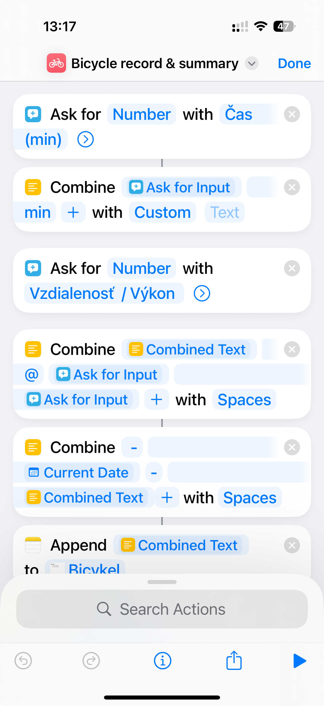

# Bicycle record & summary

Quickly record your bicycle ride, either indoor or outdoor -> will create a note and show a summary of all previous
records.

## Requirements
- iOS Shortcuts – for automation
- Notes – as your lightweight “database”
- PyTO – as the on-device code interpreter

## Python scraper

Full source in `bicycle_summary.py`

> Set the weight (you + bicycle) and wind speed in the script in order to convert the units.

## Shortcut App

