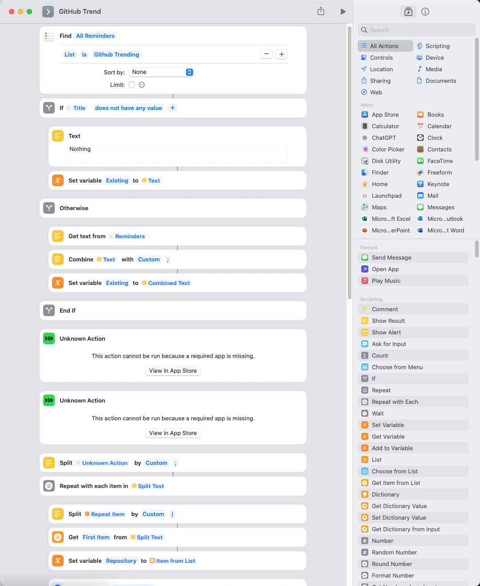
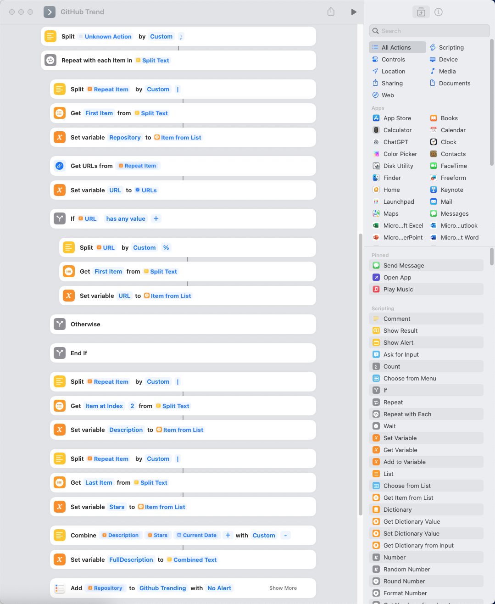
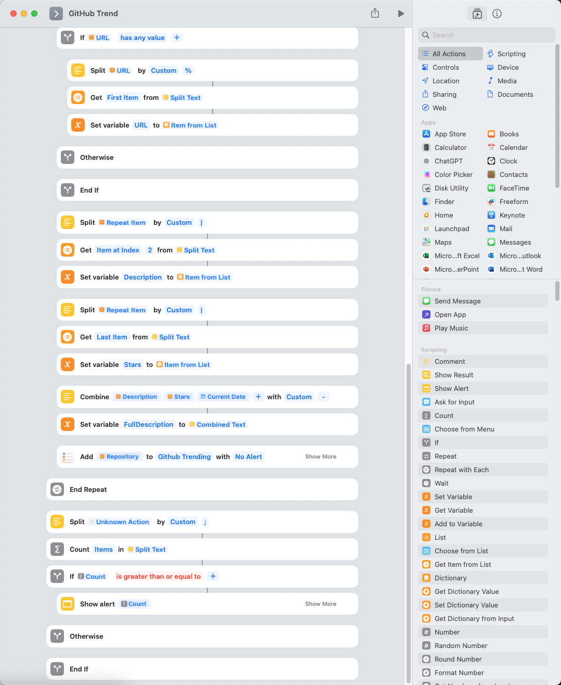

# GitHub Trending

How to turn your iPhone into a smart scraper - no servers, no subscriptions, your data.

This example shows how to automatically fetch today’s GitHub Trending repositories, save them to Notes, and skip any you’ve already “checked.”

## Requirements
- iOS Shortcuts – for automation
- Reminders (or Notes) – as your lightweight “database”
- PyTO – as the on-device code interpreter (+ bs4)

## Python scraper

```bash
pip install beautifulsoup4 requests
```

Full source in `github_trending.py`

> Pro tips: 
>   1. add LLM call to filter repository base on your preferences  
>   2. use Shortcuts automation to schedule regular scraping on your iPhone or iPad

## Shortcut App






